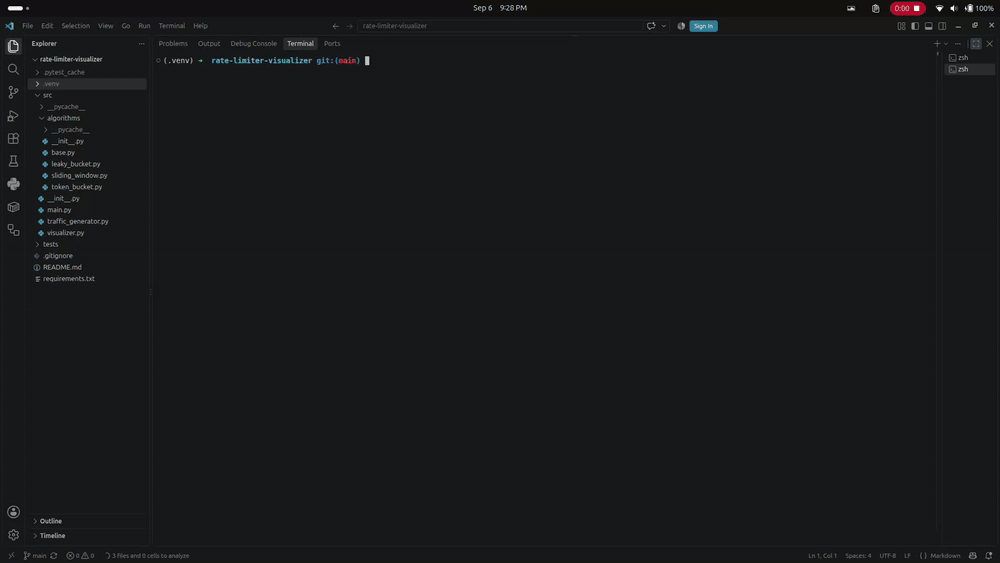

# Rate Limiter Visualizer

A Python terminal demo comparing Token Bucket, Sliding Window Log, and Leaky
Bucket against the same bursty request stream.

## Demo

Demo GIF coming soon: `assets/demo.gif`.

<!-- Uncomment after recording:  -->

## Setup and run

Requires Python 3.10 or newer. Run from this project directory:

```bash
python3 -m venv .venv
source .venv/bin/activate
python -m pip install -r requirements.txt
python -m src.main
```

On Windows PowerShell, activate with `.venv\Scripts\Activate.ps1` instead.

## Tests

```bash
python -m pytest -q
```

## Algorithm tradeoffs

The final implementation will document exact refill, window, and leak math,
the meaning of queue admission, and measured burst behavior here.
